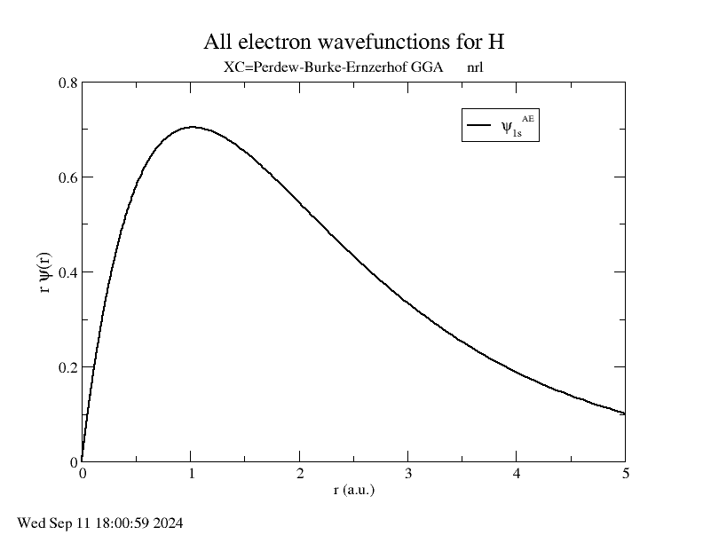

Installation
========================================

To install the latest version of OPIUM, first clone the 
`OPIUM repository <https://github.com/rappegroup/opium>`_:

.. code-block:: console

   $ git clone https://github.com/rappegroup/opium

After navigating to the created ``opium`` directory, build the binary using:

.. code-block:: console

   $ ./configure
   $ make all

OPIUM can now be called from the command line using:

.. code-block:: console

   $ ./opium input.param output.txt command1 command2 ...

To use graphical features of OPIUM, the plotting program Grace must also be installed. 
Grace can be downloaded from `its homepage <https://plasma-gate.weizmann.ac.il/Grace/>`_,
or by running the following commands.

For Linux:

.. code-block:: console

   $ sudo apt-get update
   $ sudo apt-get install grace

For MacOS:

.. code-block:: console
   
   $ brew install grace

.. note::

   OPIUM is tested using `Intel <https://www.intel.com/content/www/us/en/developer/tools/oneapi/toolkits.html>`_ 
   FORTRAN and C compilers. Although attempts have been made to allow it to be compatible with other
   compilers like GNU, AMD, and CRAY, there is no guarantee that outputs would align exactly.

If the above does not work, you can also try:

* Downloading the `statically compiled binary <https://sourceforge.net/projects/opium/>`_ for OPIUM
* Trying a different version of OPIUM
* Using a different C or FORTRAN compiler

Help
========================================
For help, you can type into the console:

.. code-block:: console

   $ ./opium help

And for more specific information on command line, plotting, and keyblocks respectively:

.. code-block:: console

   $ ./opium -c
   $ ./opium -p
   $ ./opium -k

Tutorial
========================================
Using OPIUM involves setting up a parameter file and calling commands.
This tutorial will illustrate that process with 
some very simple examples.

Hydrogen
-------------
The initial parameter file for this this Hydrogen tutorial can be 
downloaded :download:`here <h.param>`. We will walk through how to
augment this file based on OPIUM's outputs.

``h.param``:

.. code-block::

   [Atom]
   H
   1
   100 1.00  -

   [Pseudo]
   1 1.80
   opt

   [Optinfo]
   3.00  4

   [XC]
   gga

   [Configs]
   3
   100 0.75 -

   100 0.50 -

   100 0.35 -

The ``[Atom]`` keyblock indicates that the atomic symbol is ``H`` for 
hydrogen, that there is one orbital, and this orbital is "1s", 
(nlm = ``100``) with occupation ``1.00``. The ``-`` means that an eigenvalue guess 
should be generated by OPIUM. The configuration specified in the ``[Atom]`` keyblock 
is the reference configuration. It is used to construct the pseudopotential 
and will reproduce the valence electron properties of the all-electron atom in 
this configuration. 

The ``[Pseudo]`` keyblock lists the number of valence orbitals, 1, and the cut-off radius 
("rc") for the pseudopotential, which is ``1.80`` Angstroms here. ``opt`` indicates that 
we want to use the RRKJ optimized pseudopotential method. 

Since we have chosen the ``opt`` method to construct the pseudopotential, we also
need the ``[Optinfo]`` keyblock. ``3.00`` is the cut-off wavevector ("qc"), and 
``4`` is the number of bessel functions to use for the pseudopotential.

The ``[XC]`` keyblock indicates what exchange-correlation (XC) functional
to use in the all-electron solve. Here we indicated ``gga``, which means
Perdew-Burke-Ernzerhof (PBE) Generalized Gradient Approximation (GGA) will 
be used.

``[Configs]`` tests the pseudopotential on some test configurations by solving
with all-electron and solving with the pseudopotential. Here we indicate that 
there are ``3`` tests, where we slowly remove occupation from the
"1s" occupation.

After the information has been put into a parameter file, which we will 
call ``h.param``, we can run OPIUM by calling :

.. code-block:: console

   $ ./opium h.param h.log ae ps nl tc rpt 

This runs the following 5 commands:

#. ``ae`` - Perform the all-electron (AE) solve for the wavefunctions
#. ``ps`` - Construct the pseudopotential from the AE results
#. ``nl`` - Perform a non-local calculation
#. ``tc`` - Test the effectiveness of the pseudopotential on the test configurations in ``[Configs]``
#. ``rpt`` - Generate a report

Running the commands should generate at least two files:

* ``h.log`` - Contains all of the output from the commands and indicates any errors or warnings
* ``h.rpt`` - Offers a quick summary report of the pseudopotential properties

For this simple calculation, there should be no issues with that would be reflected in
the log file. Then examine the pseudopotential section on the report file. 

.. code-block::

   ====================Optimized pseudopotential method====================

                     Pseudopotential convergence error                      
   Orbital      [mRy/e]       [meV/e]         [mRy]        [meV]        Ghost
   --------------------------------------------------------------------------
   100        20.611832    280.438402     20.611832   280.438402        no

                         Tot. error =     20.611832   280.438402

This error seems very large. The pseudopotential would have approximately 
280 meV error when run at a converged cut-off energy. 

There are two direct ways to reduce the convergence error, by increasing rc or qc. 
Increasing rc leads to a less transferable potential, while increasing qc leads to a larger 
cut-off energy. So, lets plot the all-electron wavefunctions and see where rc is relative 
to to the 1s peak. This can be done by:

.. code-block:: console

   $ ./opium h.param h.log plot wa

The cut-off radius is around 1.80 Angstroms and is pretty far from the peak, which
is at around 1.00 Angstroms. Therefore, it is probably better to increase qc.
Change qc from ``3.0`` to ``4.75``, so the keyblock ``[Optinfo]`` should look 
like:

.. code-block:: 

   [Optinfo]
   4.75  4

Then rerun the pseudopotential construction:

.. code-block:: console

   $ ./opium h.param h.log ae ps nl tc rpt 

Checking the new ``h.rpt``, the results are much better, with an error of
only 2.61 meV. 

.. code-block::

   ====================Optimized pseudopotential method====================

                     Pseudopotential convergence error                      
   Orbital      [mRy/e]       [meV/e]         [mRy]        [meV]        Ghost
   --------------------------------------------------------------------------
   100         0.192534      2.619559      0.192534     2.619559        no

                         Tot. error =      0.192534     2.619559

Then we can check the transferability. This is a measure of how effective the
pseudopotentials is at configurations that are not the reference. Check the section for 
the test configurations, and observe the lines that begin with ``AE-NL``, which is 
the difference between the all-electron and pseudopotential calculations. Since
there are 3 states in the ``[Configs]`` keyblock, there are 3 differences here:

.. code-block::

   AE-NL: Orbital Filling       Eigenvalues[mRy]         Norm[1e-3] 
   AE-NL- --------------------------------------------------------------
   AE-NL-     100   0.750          -0.9812641227      -1.6996433434	
   AE-NL-   total error =           0.9812641227       1.6996433434

.. code-block::

   AE-NL: Orbital Filling       Eigenvalues[mRy]         Norm[1e-3] 
   AE-NL- --------------------------------------------------------------
   AE-NL-     100   0.500          -3.7382161298      -3.7786023814	
   AE-NL-   total error =           3.7382161298       3.7786023814

.. code-block::

   AE-NL: Orbital Filling       Eigenvalues[mRy]         Norm[1e-3] 
   AE-NL- --------------------------------------------------------------
   AE-NL-     100   0.350          -6.4826340677      -5.1011748701	
   AE-NL-   total error =           6.4826340677       5.1011748701

There is also a table of total energy difference:

.. code-block::

   AE-NL-   i   j         DD[mRy]        DD[meV] 
   AE-NL- ------------------------------------------
   AE-NL-   0   1        -0.093540      -1.272673
   AE-NL-   0   2        -0.639266      -8.697656
   AE-NL-   0   3        -1.394842     -18.977808
   AE-NL-   1   2        -0.545726      -7.424983
   AE-NL-   1   3        -1.301303     -17.705135
   AE-NL-   2   3        -0.755577     -10.280151

These values are good, but they could be improved. Let's try reducing
rc from ``1.80`` Angstroms to ``1.40`` Angstroms, which is still far from
the peak. The new ``[Pseudo]`` keyblock should look like:

.. code-block:: 

   [Pseudo]
   1 1.40
   opt

We know reducing rc will increase the error as well. To compensate, we also
increase qc from ``4.75`` to ``5.50``. The new ``[Optinfo]`` keyblock is:

.. code-block:: 

   [Optinfo]
   5.50  4

Again rerun the pseudopotential construction:

.. code-block:: console

   $ ./opium h.param h.log ae ps nl tc rpt 

Observing ``h.rpt``, the transferability is now much better and the error
is also within a tolerable range. 

Convergence error:

.. code-block::

   ====================Optimized pseudopotential method====================

                     Pseudopotential convergence error                      
   Orbital      [mRy/e]       [meV/e]         [mRy]        [meV]        Ghost
   --------------------------------------------------------------------------
   100         0.422277      5.745376      0.422277     5.745376        no

                         Tot. error =      0.422277     5.745376

Transferability:

.. code-block::

   AE-NL: Orbital Filling       Eigenvalues[mRy]         Norm[1e-3] 
   AE-NL- --------------------------------------------------------------
   AE-NL-     100   0.750          -0.3344105826      -0.7582606862	
   AE-NL-   total error =           0.3344105826       0.7582606862

.. code-block::

   AE-NL: Orbital Filling       Eigenvalues[mRy]         Norm[1e-3] 
   AE-NL- --------------------------------------------------------------
   AE-NL-     100   0.500          -1.3394630445      -1.8146139118
   AE-NL-   total error =           1.3394630445       1.8146139118

.. code-block::

   AE-NL: Orbital Filling       Eigenvalues[mRy]         Norm[1e-3] 
   AE-NL- --------------------------------------------------------------
   AE-NL-     100   0.350          -2.3941203051      -2.5689934304
   AE-NL-   total error =           2.3941203051       2.5689934304

.. code-block::

   AE-NL-   i   j         DD[mRy]        DD[meV] 
   AE-NL- ------------------------------------------
   AE-NL-   0   1        -0.031401      -0.427230
   AE-NL-   0   2        -0.223264      -3.037658
   AE-NL-   0   3        -0.498478      -6.782148
   AE-NL-   1   2        -0.191863      -2.610428
   AE-NL-   1   3        -0.467078      -6.354917
   AE-NL-   2   3        -0.275215      -3.744490

Since both of these are to our satisfaction, create a ``.upf`` file for
Quantum ESPRESSO by running:

.. code-block:: console

   $ ./opium h.param h.log all upf

Where ``all`` is a shorthand for ``ae ps nl tc``. This should create a
``h.upf`` file.

Further Examples
---------------------

.. note::

   Many of these walkthroughs were created with an older version of OPIUM.
   Results and syntax may not align exactly with newer versions.

More advanced walkthroughs are available as documents:

#. :download:`Carbon <c_tut.pdf>` - Atoms with more than 1 orbitals 
#. :download:`Aluminum <al_tut.pdf>` - Different pseudopotential construction methods and transferability testing
#. :download:`Copper <cu_tut.pdf>` - Testing for ghost states
#. :download:`Titanium <ti_tut.pdf>` - Constructing semi-core states
#. :download:`Iron <fe_tut.pdf>` - Utilizing a partial core correction
#. :download:`Platinum <pt_tut.pdf>` - Scalar-relativistic pseudopotentials
